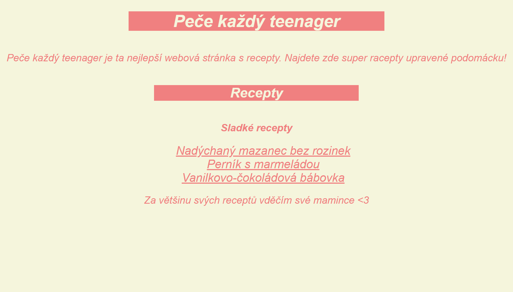

# Baking Website

A simple baking website created with HTML and CSS.  
Made as a final project for my DofE Silver Award.  

---

## 🚀 Features
- Main page with recipes and sources
- Individual recipe pages with difficulty levels

---

## 💻 Technologies Used
- HTML5
- CSS3

---

## 📸 Demo

---

## 🛠️ How to View
1. Download or clone this repo  
2. Open `index.html` in your browser  

---

## 📈 Future Plans
- Basic JavaScript for interactivity 
- Add a recipe submission form  
